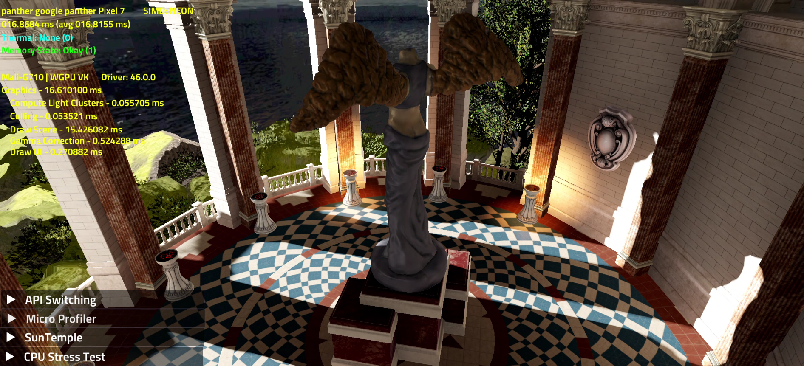
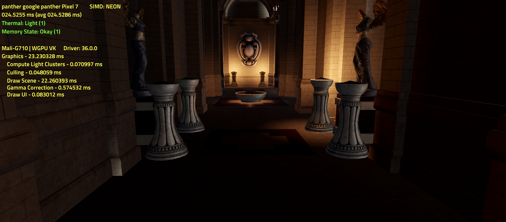

# The-Forge WebGpu

The-Forge WebGpu Dawn backend implementation - Part of one of our projects with Google
- Details
  - Showcases the SunTemple demo using WebGpu Vulkan and native Vulkan backends
  - The demo works on both Windows 10 and Android
    - Tested on
      - Pixel 7
      - Samsung S21U
      - OnePlus 9 Pro
  - The demo works with WebGpu Dawn compat mode
  - Using The-Forge parent repo at Release 1.58 https://github.com/ConfettiFX/The-Forge

# Screenshots

# Running the demo
  - Visual Studio solutions for both PC and Android are provided in WebGpu/Examples_3/SunTemple/
  - WebGpu binaries need to be placed in
    - Android - WebGpu/Common_3/Graphics/ThirdParty/OpenSource/webgpu/dawn/libs/arm64/libwebgpu_c_bundled.so
    - Windows - WebGpu/Common_3/Graphics/ThirdParty/OpenSource/webgpu/dawn/libs/x64/[Debug/Release]/...
      - List of webgpu dawn binaries required for Windows - https://github.com/ConfettiFX/The-Forge-WebGpu/blob/master/WebGpu/Examples_3/SunTemple/PC%20Visual%20Studio%202019/WebGpu.x64.props#L36
  - Android requirements
    - VS 2019
    - Android NDK: 21.4.7075529
    - AGDE: 23.2.87 (Android Game Development Extension)
  - Windows requirements
    - Windows 10/11
    - Graphics driver supporting Vulkan API

# Open-Source Libraries
The Forge utilizes the following Open-Source libraries:
* [Fontstash](https://github.com/memononen/fontstash)
* [Vectormath](https://github.com/glampert/vectormath)
* [Nothings](https://github.com/nothings/stb) single file libs 
  * [stb.h](https://github.com/nothings/stb/blob/master/stb.h)
  * [stb_image.h](https://github.com/nothings/stb/blob/master/stb_image.h)
  * [stb_image_resize.h](https://github.com/nothings/stb/blob/master/stb_image_resize.h)
  * [stb_image_write.h](https://github.com/nothings/stb/blob/master/stb_image_write.h)
  * [stb_ds](https://github.com/nothings/stb/blob/master/stb_ds.h)
* [SPIRV_Cross](https://github.com/KhronosGroup/SPIRV-Cross)
* [Vulkan Memory Allocator](https://github.com/GPUOpen-LibrariesAndSDKs/VulkanMemoryAllocator)
* [D3D12 Memory Allocator](https://github.com/GPUOpen-LibrariesAndSDKs/D3D12MemoryAllocator)
* [WinPixEventRuntime](https://blogs.msdn.microsoft.com/pix/winpixeventruntime/)
* [Fluid Studios Memory Manager](http://www.paulnettle.com/)
* [volk Metaloader for Vulkan](https://github.com/zeux/volk)
* [gainput](https://github.com/jkuhlmann/gainput)
* [Dear ImGui](https://github.com/ocornut/imgui)
* [DirectX Shader Compiler](https://github.com/Microsoft/DirectXShaderCompiler)
* [Ozz Animation System](https://github.com/guillaumeblanc/ozz-animation)
* [Lua Scripting System](https://www.lua.org/)
* [TressFX](https://github.com/GPUOpen-Effects/TressFX)
* [MTuner](https://github.com/milostosic/MTuner) 
* [meshoptimizer](https://github.com/zeux/meshoptimizer)
* [TinyImageFormat](https://github.com/DeanoC/tiny_imageformat)
* [flecs](https://github.com/SanderMertens/flecs)
* [CPU Features](https://github.com/google/cpu_features)
* [HIDAPI](https://github.com/libusb/hidapi)
* [bstrlib](https://github.com/websnarf/bstrlib)
* [cr](https://github.com/fungos/cr)
